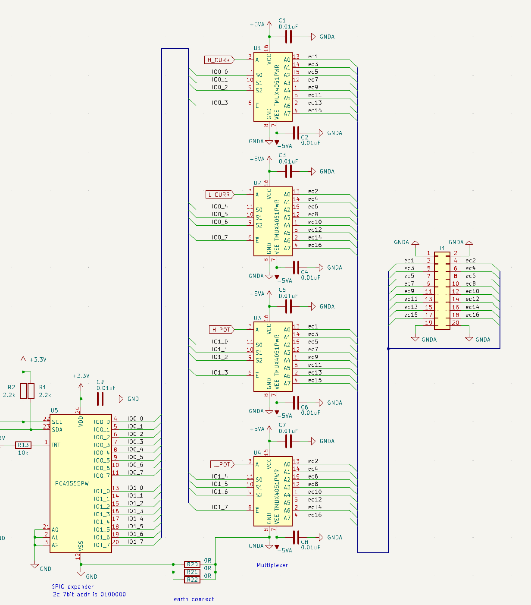
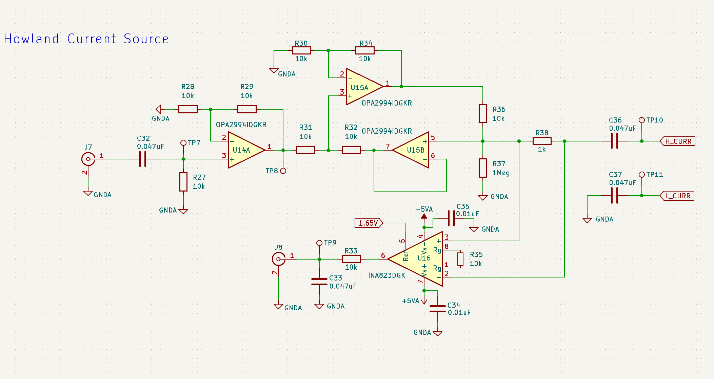
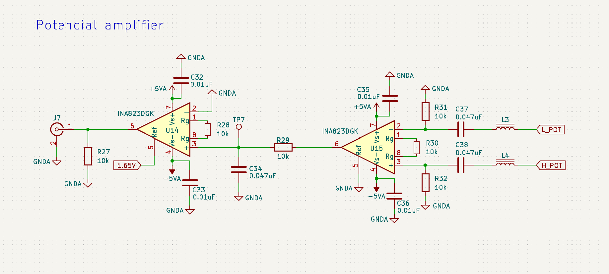

# Concept
本プロジェクトは、入手性が良く安価な部品で構成できる電気インピーダンストモグラフィ入門用ハードウエアを目指しています。 

本ハードウエアは、アナログフロントエンドのみを備えることを特徴とします。 
現在Webで公開されているオープンソースハードウエアは、データ取得部を含む物が大半です。 
これは便利ではあるのですが、サンプリング速度や上位系との通信が限定されてしまうので拡張が難しいという問題がありました。 

そこで本ボードでは、アナログフロントエンドのみを搭載することで処理系はユーザーが決めれるようになっています。
下記のようなユースケースに対応ができると考えています。

- BLEを使って無線経由で上位系にデータ送信したい
- 外部のロックインアンプで高精度計測したい
- 外部のファンクションジェネレータで励起信号の検討を行いたい 
- 使い慣れたMCU,FPGA,SoCで測定系を構成したい

# Progress
- [x] 回路設計
- [ ] AW設計
- [ ] 動作確認
- [ ] 解説ドキュメントの公開
- [ ] 学習の手引きの公開(おすすめ論文など)

# Hardware
スペックは、下記のとおりです。

- 最大16電極に対応
- 隣接電極法に対応
- アナログラインは±12V入力に対応

## Multiplexer
マルチプレクサは、電極励起パターンの切り替え、電位ポテンシャルの取得切り替えに使用されます。 
ここでは、Texas InstrumentsのTMUX4051(1.8V 互換ロジック、±12V、8:1)を採用しました。このICはGPIOによる簡単な制御、非常に安価、両電源駆動対応という特徴があります。 

マルチプレクサの制御は、I2CタイプのGPIOエクスパンダで実現していますので、多くのマイコンボードを接続可能です。

## VCCS
電極励起のための交流定電流源になります。 
Howland電流源という回路トポロジーを使用しています。

## Instrumentation Amplifier
電極ポテンシャルを計測するための初段アンプです。 
電極励起により発生するポテンシャルは、非常に微弱な信号であることから、計装アンプ回路で受け取ります。

直流成分による飽和対策としてアンプ入力にハイパスフィルタを実装しています。(使用しない際は、未実装としてショートしてください)

## Sub device
その他のコンポーネントとして温度センサ、EEPROMが実装されています。
電流源のキャリブレーションデータ、ファントム校正データなどを保存する用途に使用できます。
GPIOエクスパンダと同じI2Cバスに接続されているため、アドレス変更のみでアクセス可能です。

## Tank
タンクの作成については,下記リポジトリを参照ください
[link](./tank/tank.md)

# ver2 milestone

- クロスポイントスイッチの採用(ADG2128,CH446X)
- マルチプレクサユニットを拡張可能にする
- データ入力回路の並列化

# Other documents

# Ref
下記のオープンソースハードウエアを参考にしています。
- A Wearable Open-Source electrical impedance tomography device(2024)
- An open-source and easily replicable hardware for Electrical Impedance Tomography(2022)
- EIT-kit: An Electrical Impedance Tomography Toolkit for Health and Motion Sensing(2021)
