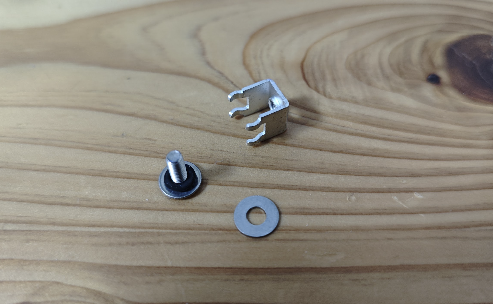
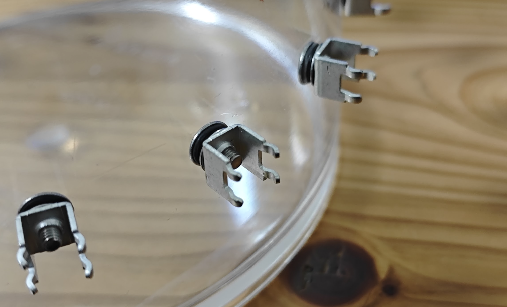

# タンクの作成

## パーツリスト
必要なパーツは下記の表に示します。 
ねじ端子は固定方法によって好きなほうを選定ください。

| 材料  | モノタロウ商品ID |単価[円]|個数|備考|
| ------------- | ------------- |--------------|--|--|
| 多目的ポット(14cm)  | 00444203  |919|1|水槽(大きさはお好み)|
| フランジボタンキャップ(12個入り)  | 41487153  |559|2|電極用|
|OリングS型固定用(NBR)|09511941|49|16|電極シール目的|
|基板用ねじ端子(垂直固定) HP-00424|11355137|1688|1|電極固定用|
|基板用ねじ端子(水平固定) HP-00423|11354972|1498|1|電極固定用|

その他あると良いもの
| 材料  | モノタロウ商品ID |単価[円]|個数|備考|
| ------------- | ------------- |--------------|--|--|
|万能バットPB-2|10071704|990|1|漏れ防止|
|六角棒レンチセット|08478742|229|1|電極締め付け用|
|3mmドリル|58095285|78|1|穴あけ用|
|3.1mmドリル|58095294|130|1|穴あけ用|

## 組み立て
フランジボタンキャップにOリングを通します。

タンクに穴を開けて同じものを16個作ります。

## カスタムパーツ
下記のような基板を作成すると取り回しが良くなります。
JLCPCBを使うと5000円で10枚程度作れます。